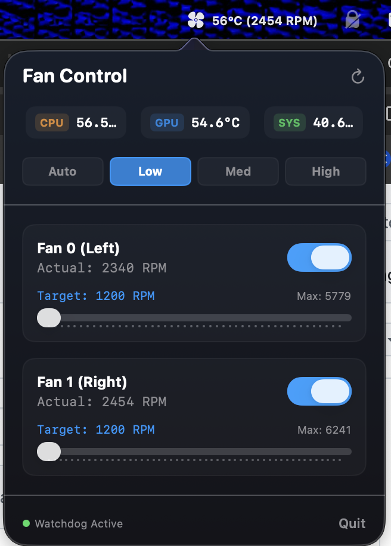

# FanControl

FanControl is a compact macOS menu bar app for monitoring and controlling Apple Silicon fan speeds. It shows live CPU, GPU, system temperature, and fan RPM data from the SMC, then lets you switch fans between Apple's automatic thermal control and manual RPM targets.

The app is intentionally small: a SwiftUI menu bar interface, a C helper for AppleSMC reads/writes, and a shell build script that packages everything into `FanControl.app`.



## What It Does

- Shows current CPU, GPU, and system temperatures in the menu popover.
- Shows the hottest fan RPM beside the menu bar icon.
- Reads every detected fan from the SMC instead of assuming a fixed fan count.
- Displays actual RPM, target RPM, hardware minimum, hardware maximum, and fan mode.
- Supports per-fan manual control with sliders.
- Includes quick presets: Auto, Low, Med, and High.
- Can register itself to launch at login from the menu popover.
- Restores individual fans or all fans to automatic mode.
- Installs a privileged helper through a one-time administrator prompt.
- Starts a watchdog helper that restores automatic fan control if the app exits unexpectedly.
- Restores automatic mode when the app quits normally.

## Safety Model

FanControl talks directly to Apple's SMC. That makes it powerful, but it also means the app should fail conservatively.

The helper validates fan indexes against the SMC-reported fan count, rejects invalid RPM input, and refuses speeds outside each fan's hardware minimum and maximum. Manual fan control requires a setuid root helper installed at:

```text
/usr/local/bin/smc-helper
```

The helper is installed as `root:admin` with mode `4550`, so members of the `admin` group can execute it and other users cannot. If the app is closed, crashes, or is killed, the watchdog attempts to return all fans to automatic mode.

Use manual fan control carefully. Apple's automatic thermal management is still the safest default for normal use.

## Requirements

- Apple Silicon Mac with AppleSMC fan keys available.
- macOS 14 or newer.
- Xcode Command Line Tools.
- Administrator access for manual fan control.

This project has SMC notes for an M1 Pro MacBook Pro in [AI_CONTEXT.md](AI_CONTEXT.md). Other Apple Silicon machines may expose different temperature keys or fan limits.

## Build

Run:

```bash
./build.sh
```

The script compiles:

- `smc_helper.c` into `smc-helper`
- `FanControlApp.swift`, `MenuView.swift`, and `HelperManager.swift` into `FanControl`
- `FanControl.app` with the app binary and bundled helper

## Run

After building:

```bash
open FanControl.app
```

FanControl appears in the menu bar. The first launch can read status data from the bundled helper. To enable manual fan changes, choose **Authorize Helper** in the popover and approve the administrator prompt.

## Install or Update

For day-to-day local installs, run:

```bash
./install.sh
```

This rebuilds the app, quits a running copy if needed, installs it to:

```text
~/Applications/FanControl.app
```

and opens the updated app.

To install somewhere else:

```bash
FANCONTROL_INSTALL_DIR=/Applications ./install.sh
```

Installing to `/Applications` may require administrator permissions depending on your Mac's ownership and permissions.

## Helper CLI

The helper can also be called directly:

```bash
./smc-helper status
sudo ./smc-helper set 0 2500
sudo ./smc-helper auto
sudo ./smc-helper auto 1
sudo ./smc-helper watchdog <pid>
```

Commands:

- `status`: prints JSON with temperatures and fan data.
- `set <idx> <rpm>`: puts one fan into manual mode and sets its target RPM.
- `auto`: restores automatic mode for all fans.
- `auto <idx>`: restores automatic mode for one fan.
- `watchdog <pid>`: monitors a process and restores automatic mode after it exits.

## Project Layout

```text
FanControlApp.swift     App entry point, menu bar item, lifecycle cleanup
MenuView.swift          SwiftUI popover UI and fan controls
HelperManager.swift     Polling, helper installation, helper command runner
smc_helper.c            AppleSMC reader/writer and CLI
build.sh                Local build and app packaging script
install.sh              Local rebuild, install, and relaunch helper
AI_CONTEXT.md           Canonical project context for AI coding agents
AGENTS.md               Codex entrypoint that points to AI_CONTEXT.md
GEMINI.md               Gemini/Antigravity entrypoint that points to AI_CONTEXT.md
CLAUDE.md               Claude Code entrypoint that points to AI_CONTEXT.md
```

## Feature Ideas

These are not implemented yet, but they fit the current architecture.

- **Temperature-based fan curves**: let users define quiet, balanced, and performance curves that map temperature ranges to target RPMs.
- **Per-app profiles**: automatically switch fan behavior when Xcode, a game, a video export, or another heavy process is active.
- **Thermal history graphs**: show recent temperature and RPM history in the popover, with simple trend indicators.
- **Menu bar compact modes**: allow icon-only, temperature-only, RPM-only, or CPU/RPM display.
- **Safe boost timer**: run fans at a selected speed for 5, 10, or 30 minutes, then automatically return to Auto.
- **Sensor explorer**: list readable SMC temperature keys so unsupported machines can be mapped without changing C code first.
- **Machine profiles**: store known fan labels, temperature keys, and defaults by hardware model.
- **Notification thresholds**: alert when CPU temperature, GPU temperature, or fan RPM stays above a chosen threshold.
- **Command log and diagnostics**: expose recent helper results, SMC errors, and privilege status to make debugging easier.
- **Unsigned-build warning flow**: explain Gatekeeper/quarantine behavior for local builds and show how to remove quarantine if needed.
- **Unit-style helper tests**: add validation tests around CLI parsing, RPM bounds, JSON output, and fan index handling.

## Notes

This is a local developer build, not a signed or notarized macOS app. Distributing it to other machines would need a more formal privileged helper design, code signing, notarization, and install/uninstall flow.
